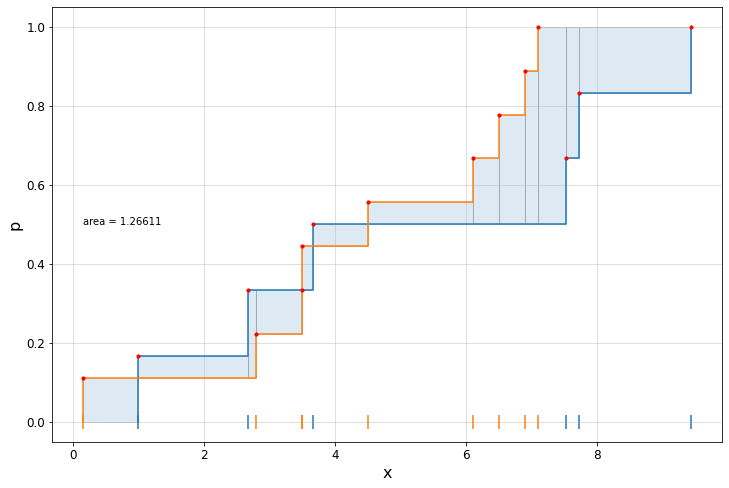
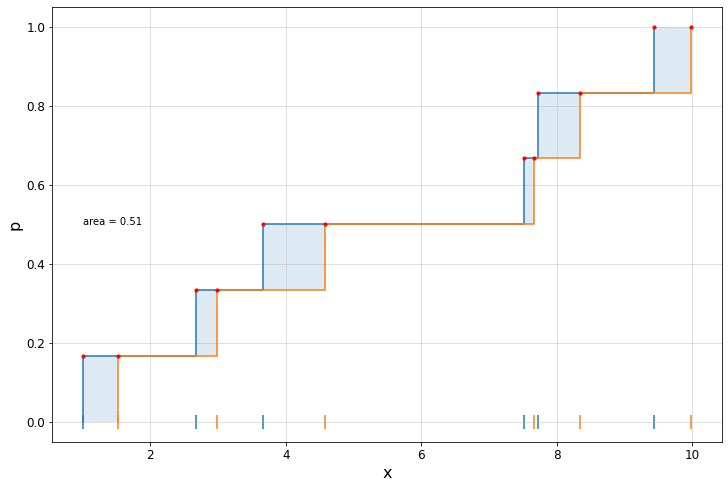
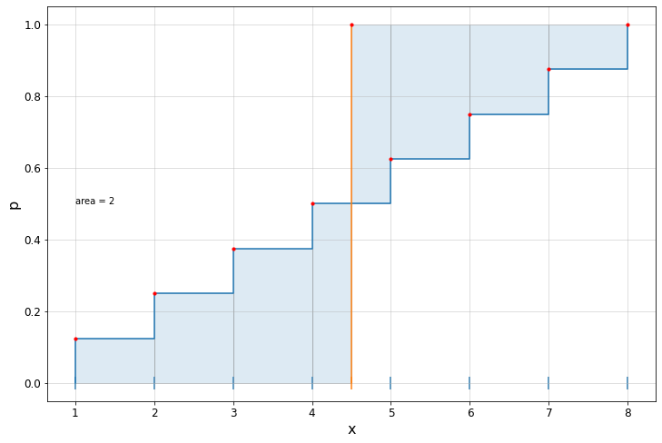

# Welcome!

[](https://zenodo.org/badge/latestdoi/326476924)

[](https://codecov.io/gh/marcodeangelis/Stochastic-area-metric)

*stochastic area metric* is a scientific code library written in Python, for computing efficiently the area metric, a.k.a. 1-Wasserstein distance. The code is optimized by running Numpy under the hood, thus is as vectorized as possible. 
A basic Matlab version is also present in this repository. 

This is an __open source project__: we welcome contributions to enlarge and improve this code. If you see any error or problem, please open a new issue. If you want to join our team of developers, get in touch!

We especially welcome contributions to extend this code to other languages like R and Julia. 

>*Disclaimer 1:* While this code has been optimized to deal with large data sizes, it is by no means the most efficient implementation. We always look to improve the efficiency of the code taking advantage of the most recent features of vector programming.

>*Disclaimer 2:* The stochastic area metric can be efficiently computed with SciPy using `scipy.stats.wasserstein_distance(x,y)`. So why reinventing the wheel? Well, our code can compute the area metric between tensors element-wise, i.e. when `x` and `y` have compatible but multiple dimensions. Moreover, we provide code for computing the area metric of a mixture of CDFs, for producing confidence bands, as well as for plotting. 

## Theory

The stochastic area metric is a **metric** in the very sense of the word. Although it is often referred to as *Wasserstein distance* or *Kantorovich-Rubinstein distance*, it is indeed a metric and coincides with the area between the two cumulative distributions or CDFs (see [1] for more). Despite its popularity has recently peaked with the work of Villani et al. on optimal transport, the metric has been around for longer than generally believed. Some say that the very notion of metric came around with Frechet while attempting to establish a distance between probability distributions. 

## Use this code:
* To compute the area between two 1d cumulative distributions or CDFs obtained from empirical tabular data. The area metric will be computed element-wise. 

* To compute the 1d area metric between compatible tensors of any dimensions element-wise. 

* To compute the area metric of the envelope of a mixture of cumulative distributions. 

* To plot the area between the cumulative distributions.

* To compute the absolute value of the difference of two random variables `X` and `Y`, that is `|X-Y|` under perfect dependence. 

## Unanswered questions

* Can the absolute value of the difference of two random variables `X` and `Y`, that is `|X-Y|`, be computed under no dependency statement?

* Can the 1d area metric be extended to comparing bivariate or even multivariate empirical cumulative distributions?


## Applications in engineering

The stochastic area metric has been recently applied in engineering for model validation [2,3,4], model calibration [5,6], and model ranking [7]. For more about model validation is reader is referred to the DAWS/SANDIA report.

## Acknowledgements
Thanks to Scott Ferson, Ander Gray, Enrique Miralles-Dolz and Dominic Calleja. 


## References

[1] de Angelis, M. and Gray, A., 2021. Why the 1-Wasserstein distance is the area between the two marginal CDFs. *arXiv preprint arXiv:2111.03570*. 
https://doi.org/10.48550/arXiv.2111.03570 

[2] Ferson, S. and Oberkampf, W.L., 2009. Validation of imprecise probability models. *International Journal of Reliability and Safety*, 3(1-3), pp.3-22.

[3] Ferson, S., Oberkampf, W.L. and Ginzburg, L., 2008. Model validation and predictive capability for the thermal challenge problem. *Computer Methods in Applied Mechanics and Engineering, 197(29-32)*, pp.2408-2430.

[4] Oberkampf, W.L. and Ferson, S., 2007. *Model Validation Under Both Aleatory and Epistemic Uncertainty* (No. SAND2007-7163C). Sandia National Lab.(SNL-NM), Albuquerque, NM (United States).

[5] Gray, A., Wimbush, A., de Angelis, M., Hristov, P.O., Calleja, D., Miralles-Dolz, E. and Rocchetta, R., 2022. From inference to design: A comprehensive framework for uncertainty quantification in engineering with limited information. *Mechanical Systems and Signal Processing*, 165, p.108210. https://doi.org/10.1016/j.ymssp.2021.108210

[6] Gray, A., Wimbush, A., de Angelis, M., Hristov, P.O., Miralles-Dolz, E., Calleja, D. and Rocchetta, R., 2020. Bayesian calibration and probability bounds analysis solution to the Nasa 2020 UQ challenge on optimization under uncertainty. In *30th European Safety and Reliability Conference, ESREL 2020 and 15th Probabilistic Safety Assessment and Management Conference, PSAM 2020* (pp. 1111-1118). Research Publishing Services.

[7] Sunny, J., de Angelis, M. and Edwards, B., 2022. Ranking and Selection of Earthquake Ground‐Motion Models Using the Stochastic Area Metric. *Seismological Society of America*, 93(2A), pp.787-797. https://doi.org/10.1785/0220210216

[8] https://en.wikipedia.org/wiki/Wasserstein_metric

[9] https://docs.scipy.org/doc/scipy/reference/generated/scipy.stats.wasserstein_distance.html


---

## Cite

> De Angelis M., Sunny J. (2021). *The stochastic area metric*. Github repository. 
> 
> https://github.com/marcodeangelis/stochastic-area-metric/ 
> 
> doi: https://doi.org/10.5281/zenodo.4419644

BibTex:

``` bibtex
@misc{DS2021,
  author = {De Angelis, M., Sunny, J.},
  title = {Stochastic area metric},
  year = {2021},
  publisher = {GitHub},
  journal = {GitHub repository},
  doi = {10.5281/zenodo.4419645},
}
```

---


# Installation
First, download or clone this repository on your local machine.

If you don't have Github ssh keys (you may have to enter your github password) use:

`git clone  https://github.com/marcodeangelis/stochastic-area-metric.git`

Otherwise:

`git clone git@github.com:marcodeangelis/stochastic-area-metric.git`


> If you don't have a Github account, just click on the code green button  at the top of this page, and hit Download. This will zip and download the code in your designated downloads folder.


Then, open a code editor in the cloned or downloaded folder. 

## Dependencies

Only Numpy is a mandatory dependency. So the `requirements.txt` is just one line:

```
numpy>=1.22
```

We recommend installing also `matplotlib` for plotting. 

### Virtual environment

Set up your Python3 virtual environment to safely install the dependencies.

On MacOS/Linux:

```bash
$ python3 -m venv myenv 

$ source myenv/bin/activate 

# On Windows replace the second line with: 

#$ myenv\Scripts\activate

(myenv) $ pip install -r requirements.txt
```


# Stochastic area metric

Let's see the code in action. 


## Importing the code

There are two recommended ways to import the code. 

(1) Make use of the default importer defined in the `__init__.py`, which can be invoked as follows:

```python
import areametric as am
```

(2) Explicitly import the needed classes and functions: 

```python
from .areametric import (areaMe)
from .dataseries import (dataseries,mixture) 
from .methods import (ecdf, quantile_function, quantile_value, inverse_quantile_function, inverse_quantile_value)
from .plotting import (plot_area, plot_ecdf, plot_ecdf_boxed)
from .examples import (skinny, puffy)
```

In what follows we'll be using the importer as in (1).

## Basic use

Let `x` and `y` be two vectors containing some samples:

```python
x = [1.  , 2.68, 7.52, 7.73, 9.44, 3.66]
y = [3.5 , 6.9 , 6.1 , 2.8 , 3.5 , 6.5 , 0.15, 4.5 , 7.1 ]
```

The area metric between `x` and `y` is:

```python
print(am.areaMe(x,y,areame=True,grid=True))
# 1.266111111111111
```

We can plot the results using:

```python
am.plot_area(x,y)
```


We can also output the individual chunks of area in each pocket between the two ECDFs as follows:

```python
print(am.area_chunks(x,y))
# array([0.09444444, 0.09333333, 0.02666667, 0.07777778, 0.        ,
#        0.01777778, 0.04666667, 0.08888889, 0.06666667, 0.11111111,
#        0.07777778, 0.21      , 0.07      , 0.285     ])
```

When the two samples have the same size, the code is fastest. For example, 

```python
x = [1.  , 2.68, 7.52, 7.73, 9.44, 3.66]
y = [1.52, 2.98, 7.67, 8.35, 9.99, 4.58]
```

The area metric between their empirical CDFs is: 

```python
print(am.areaMe(x,y))
# 0.51
am.plot_area(x[0],x[1],areame=True,grid=True)
```



For speed comparisons see the speed test section below.

One neat aspect of the area metric is that when it is computed between two samples of size one, it coicides with their absolute-value difference. So for example, 

```python
x = [1.]
y = [5.]

print(am.areaMe(x,y))
# 4.0

am.plot_area(x,y)
```


The value of the area metric can be visually checked in this simple example:

```python

x = [1,2,3,4,5,6,7,8]
y = [4.5]

am.plot_area(x,y)

```




# Tabular data

Data is often tabular that is, each sample or repetition has a dimension greater than one.  For example, each sample can be a vector, a matrix or a Nd-array. In this section, we show how the area metric can be computed between such data structures.


Let's say that we have collected `12` samples by repeating the experiment `12` times, and that each sample has dimension `5`. This can be simulated as follows: 


```python
import numpy as np

X = np.random.random_sample(size=(12,5))
print(X)

# array([[0.04527675, 0.18058022, 0.83483974, 0.20334532, 0.27590853],
#        [0.76807063, 0.93299813, 0.60225259, 0.16446953, 0.84007895],
#        [0.86458905, 0.64276872, 0.31071849, 0.14774229, 0.51298122],
#        [0.50736646, 0.8930979 , 0.04205184, 0.75907262, 0.53567193],
#        [0.45788587, 0.32284657, 0.53675174, 0.43546077, 0.83565934],
#        [0.84218961, 0.73167643, 0.56177487, 0.38364206, 0.75746045],
#        [0.03516969, 0.54456781, 0.01782834, 0.142004  , 0.34417284],
#        [0.9364045 , 0.05616066, 0.21798012, 0.00570423, 0.29383644],
#        [0.90708253, 0.17531977, 0.56832402, 0.60719305, 0.45636999],
#        [0.30125421, 0.60050635, 0.76733594, 0.98383987, 0.55236829],
#        [0.17019925, 0.49134387, 0.57615902, 0.42568625, 0.69711672],
#        [0.36498332, 0.55498882, 0.72334561, 0.84833707, 0.54902545]])

```

where each row is a repetition. In this case, we have `5` empirical CDFs, one per column.
 
After some time, we run the experiment again but this time we were able to collect `16` samples: 

```python
import numpy as np

Y = np.random.random_sample(size=(16,5))
print(Y)

# array([[0.83235093, 0.23314584, 0.73013484, 0.39847496, 0.56583051],
#        [0.09393461, 0.44382946, 0.07631647, 0.0841699 , 0.73952238],
#        [0.66665044, 0.17642032, 0.8439162 , 0.100093  , 0.02463167],
#        [0.24979119, 0.01868264, 0.78786915, 0.29982384, 0.55241164],
#        [0.07815242, 0.91828644, 0.61846902, 0.36558736, 0.27444652],
#        [0.48523485, 0.76434758, 0.83882121, 0.17205013, 0.12962654],
#        [0.25140272, 0.22861422, 0.67099368, 0.47222509, 0.18698356],
#        [0.3962769 , 0.42666101, 0.49680613, 0.56422487, 0.74740086],
#        [0.02875459, 0.63772695, 0.97479149, 0.32063228, 0.10539502],
#        [0.80259886, 0.82945329, 0.04963868, 0.70643957, 0.45530741],
#        [0.38383305, 0.15311944, 0.61023661, 0.7683453 , 0.74960574],
#        [0.91850915, 0.22239737, 0.48737351, 0.81254822, 0.6884226 ],
#        [0.98575789, 0.59398102, 0.15752593, 0.94701218, 0.04589263],
#        [0.78931509, 0.31976821, 0.8909194 , 0.53275181, 0.28998319],
#        [0.07705132, 0.90429747, 0.59616118, 0.0337019 , 0.37184221],
#        [0.18131878, 0.59067564, 0.56450754, 0.8391249 , 0.89016927]])
```

At this point we want to compare these two samples `X` and `Y` and see if there has been any appreciable change. We can compute the area metric right away:

```python
print(am.areaMe(X,Y))
# array([0.07965167, 0.06417032, 0.10972713, 0.06525735, 0.13565671])

```

which will output an ndarray with the area metric between the two samples for each of the `5` dimensions. 

This was possible because `X` and `Y` are both compatible *tabular* dataseries, i.e. they are samples with the same dimension. We can use the parser `dataseries` to analyse these two samples: 


```python

X_ds = am.dataseries(X)
print(X_ds.info)
# {'class': 'DataSeries', 'rep': 12, 'dim': (5,), 'tabular': True}

Y_ds = am.dataseries(Y)
print(Y_ds.info)
# {'class': 'DataSeries', 'rep': 16, 'dim': (5,), 'tabular': True}
```


<!-- Given two datasets `x` and `y` the universal parser `dataseries` will cast an array-like numeric data structure into an object called `DataSeries` that the library uses. The parser `dataseries` will make sure that `x` is of numeric type and can be seen as a sample. The first dimension of the array-like structure `x` will be interpreted as the 'repetitions' dimension; the remaining dimensions will constitute the dimension of the sample. -->


# Parametric (simulated) data

Parametric data is data obtained sampling at random from probability distributions such as the Lognormal distribution.

Let's define a Lognormal distribution using the moments.


```python
lognormal_dist = am.Lognormal(5,1)
print(lognormal_dist)

#     x ~ Lognormal(m=5, s=1)
```


Let's plot this distribution.


```python
lognormal_dist.plot(N=100)
```


Now we can use the `Lognormal` distribution to generate two datasets. 

We will use different mean and standard-deviation for the two datasets.


```python
lognormal_dist_1 = am.Lognormal(5,1)
lognormal_dist_2 = am.Lognormal(7,4)
```

We can now generate the datasets using the method `sample`. 

We will generate a big number of samples to test the speed of the code.


```python
d1 = am.Dataset(list(lognormal_dist_1.sample(N=100_000)))
d2 = am.Dataset(list(lognormal_dist_2.sample(N=100_000)))
```


```python
d1-d2

#     2.319762595668186
```

Below we time the execution. It takes a small fraction of a second (0.265 s) to compute the distance between two datasets with 1e5 elements. 


```python
%timeit d1-d2

# 265 ms ± 3.95 ms per loop (mean ± std. dev. of 7 runs, 1 loop each)
```


The plot is done using less samples as accuracy is not a priority.


```python
am.plot(list(lognormal_dist_1.sample(N=300)),list(lognormal_dist_2.sample(N=300)))
```


The median difference is:


```python
abs(lognormal_dist_1.median() - lognormal_dist_2.median())

#    1.1747986164166138
```


To get better accuracy we can generate the datasets using directly the inverse cumulative distribution, aka *percent point function* `ppf`. In this way we'll get rid of the sampling error, and we'll get an answer that is deterministic and not as sensitive to the cardinality of the dataset.

We'll use the class `ParametricDataset` to generate the data.


```python
x1 = am.ParametricDataset(lognormal_dist_1, N=300)
x2 = am.ParametricDataset(lognormal_dist_2, N=300)
am.plot(x1.to_list(),x2.to_list())
```


```python
x1-x2

# 2.3319029880776765
```


We can check that the obtained result coincides exactly with the result from the `scipy` code library. Scipy can thus be used as a test bed.


```python
from scipy.stats import wasserstein_distance # https://docs.scipy.org/doc/scipy/reference/generated/scipy.stats.wasserstein_distance.html
wasserstein_distance(x1,x2)

#     2.331902988077677
```


# Data mixtures


# Speed tests